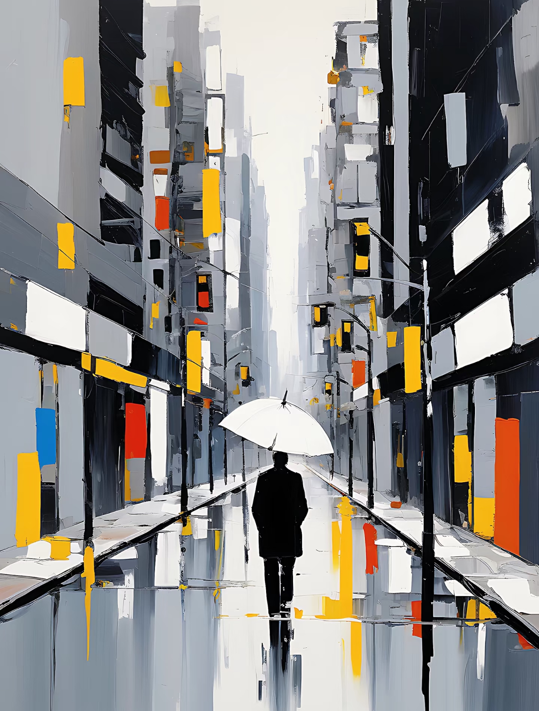
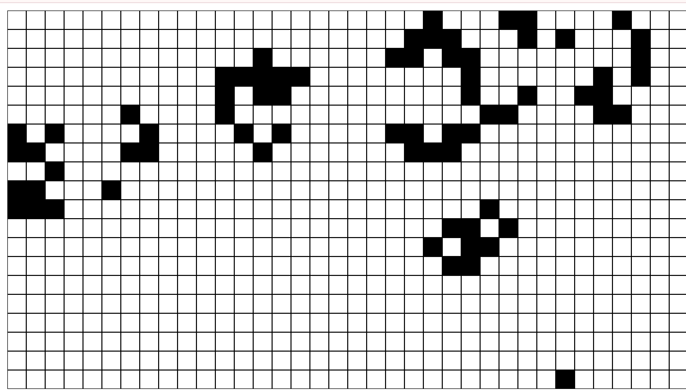

# Week8-Quiz
## Part 1: Imaging Technique Inspiration
Mondrian’s *Broadway Boogie Woogie* abstracted the rhythm and energy of New York City into color blocks and grid patterns. My inspiration flips this logic: I reimagine those iconic red, yellow, and blue blocks back into architectural elements within urban scenes. The two reference artworks blend geometric abstraction with tangible form. This reversal—from abstract back to concrete—shows how rhythm and structure can flow both ways. Furthermore, the grid layout lends itself to time-based transformation: block colors, positions, and line density can evolve over time in a radiating or rhythmic pattern, echoing the musical pulse that inspired Mondrian’s original work.

### Reference Images
  

## Part 2: Coding Technique Exploration
I use a time-based animation technique in p5.js to simulate a “glitch” aesthetic applied to Mondrian’s geometric grid. A 2D array of squares is drawn to the canvas, and each cell randomly switches between red, yellow, blue, white, and black on every frame using random() and frameCount. This creates a flickering, malfunctioning-TV effect that echoes the rhythm and grid logic of Broadway Boogie Woogie, but reimagined with cyberpunk visual language. The result is a dynamic reinterpretation of Mondrian’s abstraction—pulsating with time, chaos, and controlled unpredictability, perfectly suited for generative coding.

### Screenshot of Code in Action

 [Example Code on p5.js Website](https://p5js.org/examples/math-and-physics-game-of-life/)

 **Commit Message:** `Quiz 8`
